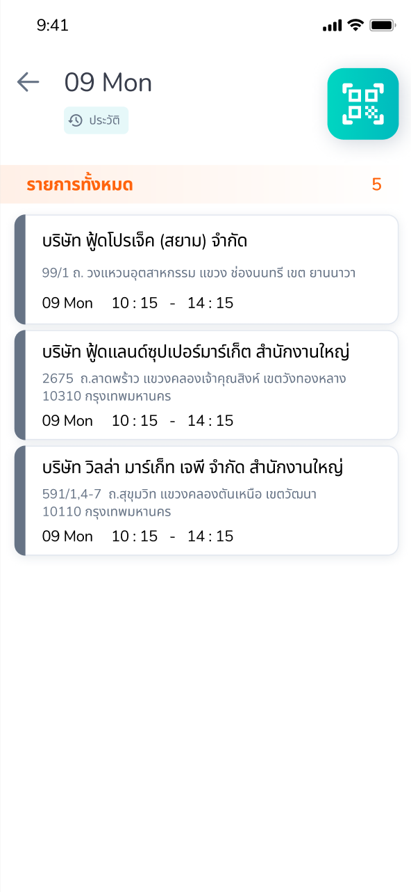
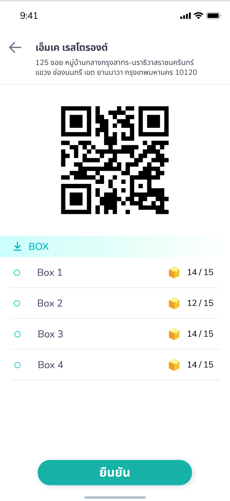

## Siametrics QA Assignment
#### 1. Basic Programming
You are given a string word that consists of digits and lowercase English letters.You will replace every non-digit character with a space. For example, ```"a123bc34d8ef34"``` will become ```" 123  34 8  34"```. Notice that you are left with some integers that are separated by at least one space: ```"123", "34", "8"```, and ```"34"```.

Return the number of different integers after performing the replacement operations on word.

Two integers are considered different if their decimal representations without any leading zeros are different.

##### Example 1:

```
Input: word = "a123bc34d8ef34"
Output: 3
Explanation: The three different integers are "123", "34", and "8". Notice that "34" is only counted once.
```

##### Example 2:

```
Input: word = "leet1234code234"
Output: 2
```

##### Example 3:
```
Input: word = "a1b01c001"
Output: 1
Explanation: The three integers "1", "01", and "001" all represent the same integer because
the leading zeros are ignored when comparing their decimal values.
```

#### 2. QA Skills
Company A is developing a mobile application for truck driver. The application help truck driver to track their job, scan boxs at pickup point or delivery point for validating order and much more.

In this splint, you were given a User story from PO as follow,
```
As a Driver, I could see a list of my today jobs in first page,
when I click on any of item on the job list, app will push to scanning page. 
On the scanning page could show the list of boxs that I have to scan,
current number of boxs that I have scanned, and when I scan the barcode,
app will match barcode with box that were assigned to me, but if I scan the box that is not on my list,
app will reject and show the error, whenever I complete all boxes that I have to scan.
After completed scanning all assigned job, I could click submit button to confirm my job

```
Frontend developer developed the application which first page is a list of job and second page is list of boxs that driver has to scan to complete their job
<p align="center">


</p>

Backend Developer developed the RESTful API as follows

1. List of Driver job ```GET /jobs``` 
2. List of Boxs in job ```GET /boxs/{id}```
3. Scan box ```POST /scan``` , request body could be ```{code:Integer}```
4. Complete job ```POST /done```

##### Deliverable
1. Test Plan in this Splint
2. Test Case for Frontend to cover all possible case
3. Script of Automated Rest API testing with ROBOT Framework, and instruction to run your script


#### Appendix

##### How to run Backend mock server
1. You must use json-server for querying data.
2. Installation

```
npm install -g json-server
```

3. Start a backend server

```
json-server --watch db.json
```

4. Example of query
   `http://localhost:3000/jobs`
